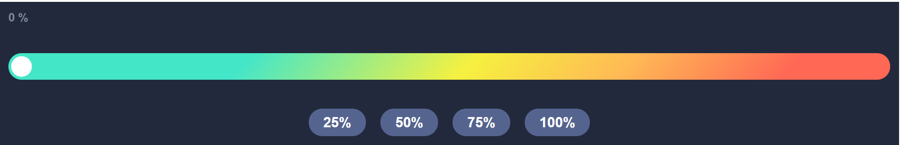
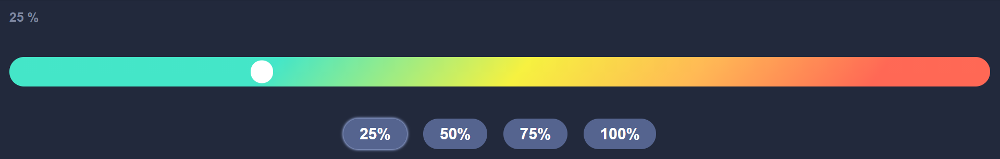
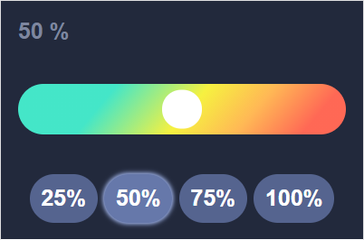

# range-slider

## Тестовое задание. Custom component range.

Реализовать полностью кастомный "Range input" аналог input с type="range".
На выходе долен быть Vue-component. Работать должен как на desktop так и на мобильной версии. На вход компонента должно поступать начальное значение процента. Компонент должен иметь возможность использовать директиву v-model.





## Установка
```
npm install
```

### Компиляция и hot-reloads для режима разработки
```
npm run serve
```

### Компиляция и минификация для production
```
npm run build
```

### Линтинг
```
 npm run lint
```
